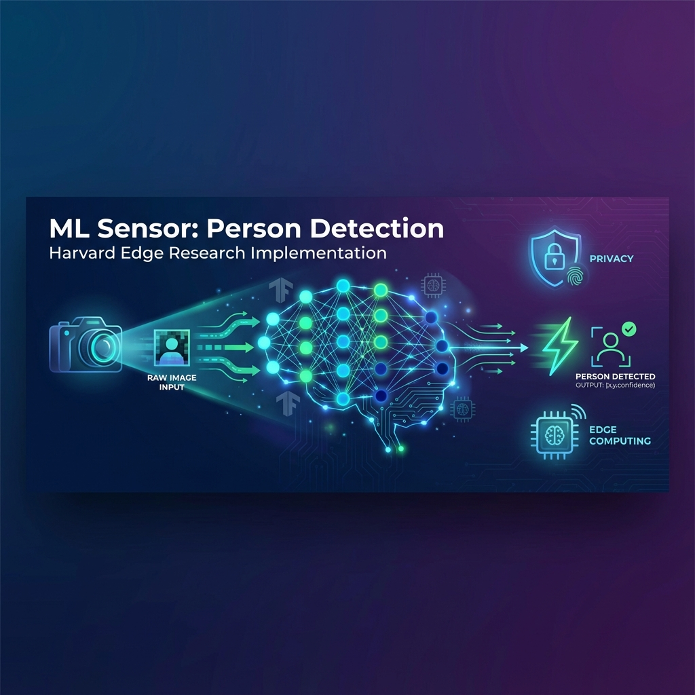
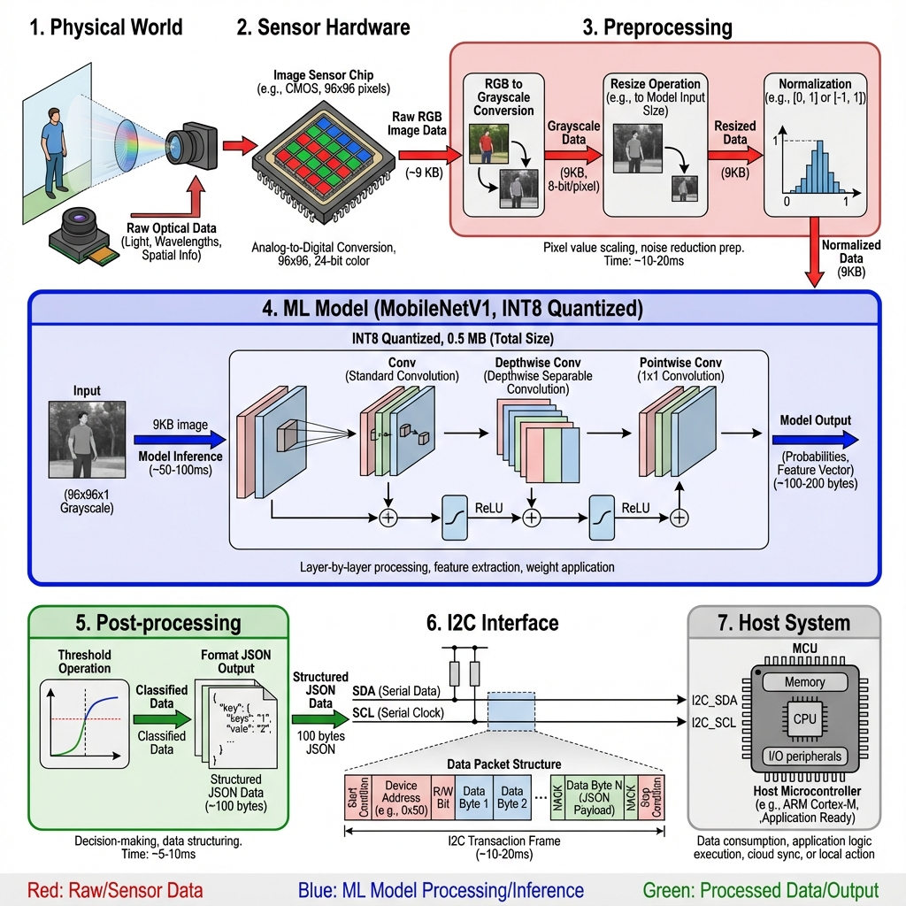
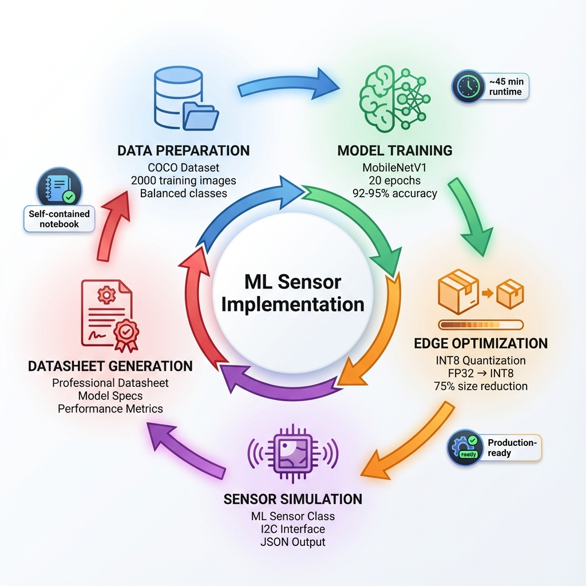

# ML Sensor: Person Detection Implementation



<p align="center">
  <strong>Implementation of Harvard Edge ML-Sensors Research</strong><br>
  <em>Privacy-Preserving Edge AI for Person Detection</em>
</p>

<p align="center">
  
  
  
  
</p>

---

This project implements a complete **Machine Learning Sensor** for person detection, following the paradigm defined in the Harvard Edge research papers.

## 📚 What is an ML Sensor?

An ML Sensor is a self-contained system that:
- Processes sensor data **on-device** using machine learning
- Outputs only **high-level insights** (not raw data)
- Provides a **simple, standardized interface**
- Enhances **privacy and security**
- Reduces **bandwidth and latency**

### Architecture Overview



### Traditional IoT vs ML Sensor


---

## 🎯 What This Project Includes

### 1. Person Detection Model
- **Architecture:** MobileNetV1 (optimized for edge devices)
- **Input:** 96×96 grayscale images
- **Output:** Binary classification (person detected: yes/no + confidence)

### 2. Edge Optimization
- **Quantization:** FP32 → INT8 conversion
- **Model size reduction:** ~75%
- **Minimal accuracy degradation:** <2%

### 3. ML Sensor Simulation
- Complete sensor interface class
- I2C-compatible output format
- Preprocessing → Inference → Post-processing pipeline

### 4. Professional Datasheet
- Model characteristics
- Dataset nutrition label
- Performance analysis
- Hardware specifications

### Project Workflow



---

## 🚀 Getting Started

### Prerequisites

```bash
pip install tensorflow>=2.13 tensorflow-datasets opencv-python pillow scikit-learn matplotlib seaborn tqdm
```

### Run the Notebook

```bash
jupyter notebook ML_Sensor_Person_Detection.ipynb
```

The notebook will:
1. Download and prepare the COCO dataset
2. Train a MobileNetV1 person detector
3. Quantize the model for edge deployment
4. Create an ML Sensor simulation
5. Generate a professional datasheet

**Estimated runtime:** 30-45 minutes (including training)

## 📊 Expected Results

- **Accuracy:** ~92-95%
- **Model Size:** ~0.5 MB (quantized)
- **Inference Time:** ~50-100 ms (CPU)
- **Data Transmitted:** ~100 bytes (vs 9KB raw image)
- **Privacy:** Images processed locally, never transmitted

## 📁 Project Structure

```
ML Sensors CSProject/
├── ML_Sensor_Person_Detection.ipynb    # Main notebook
├── README.md                            # This file
└── ml_sensor_data/                      # Generated during execution
    ├── dataset/                         # Downloaded images
    ├── models/                          # Trained models
    │   ├── best_model.h5               # FP32 Keras model
    │   ├── person_detector_fp32.tflite # FP32 TFLite
    │   └── person_detector_int8.tflite # INT8 quantized
    └── results/                         # Visualizations & datasheet
        ├── sample_data.png
        ├── training_history.png
        ├── confusion_matrix.png
        ├── ml_sensor_demo.png
        ├── ml_sensor_datasheet.json
        └── ml_sensor_datasheet.md
```

## 🎓 Learning Outcomes

By completing this project, you'll learn:

✅ **TinyML Concepts:** Model quantization, edge optimization  
✅ **Computer Vision:** Person detection, image preprocessing  
✅ **Hardware-Software Co-Design:** Simulating sensor interfaces  
✅ **ML Ethics:** Dataset transparency, privacy-preserving AI  
✅ **Professional Documentation:** Creating ML sensor datasheets  

## 🔬 Key Concepts Demonstrated

### 1. Privacy by Architecture
```
Traditional IoT:  Camera → Raw Image (9KB) → Cloud → Result
ML Sensor:        Camera → On-Device ML → Result (100 bytes)
```

### 2. Edge Optimization
- **Quantization:** Reduces model size with minimal accuracy loss
- **MobileNet:** Designed specifically for mobile/embedded devices
- **Preprocessing:** Grayscale conversion, resizing for efficiency

### 3. Standardized Interface
```json
{
  "sensor_id": "0x62",
  "person_detected": true,
  "confidence": 0.95,
  "inference_time_ms": 87,
  "timestamp": 1736125783
}
```

## 📖 References

- [ML Sensors Whitepaper](https://arxiv.org/abs/2206.03266)
- [Datasheets for ML Sensors](https://arxiv.org/abs/2306.08848)
- [Harvard Edge ML-Sensors Repository](https://github.com/harvard-edge/ML-Sensors)
- [MLSensors.org](https://mlsensors.org/)

## 🛠️ Next Steps

### Hardware Deployment
Deploy the quantized model to:
- Raspberry Pi 4 with camera module
- Arduino Nano 33 BLE Sense
- ESP32-CAM module

### Model Improvements
- Collect domain-specific data
- Implement advanced augmentation
- Try different architectures (EfficientNet-Lite, etc.)

### Advanced Features
- Multi-person detection
- Activity recognition
- Real-time video processing
- Integration with IoT systems

### Research Extensions
- Federated learning for privacy-preserving updates
- Adversarial robustness testing
- Energy consumption profiling
- Benchmarking against other TinyML frameworks

## 🤝 Contributing

This is an educational project. Feel free to:
- Experiment with different models
- Improve the datasheet format
- Add new features
- Share your results!

## 📜 License

This project is for educational purposes, following the Harvard Edge ML-Sensors research.

## 🙏 Acknowledgments

- **Harvard Edge Team** for the ML Sensors paradigm
- **TensorFlow Team** for TFLite and quantization tools
- **COCO Dataset** for training data

---

**Happy Learning! 🎉**

*For questions or issues, refer to the comprehensive guide in the artifacts folder.*
